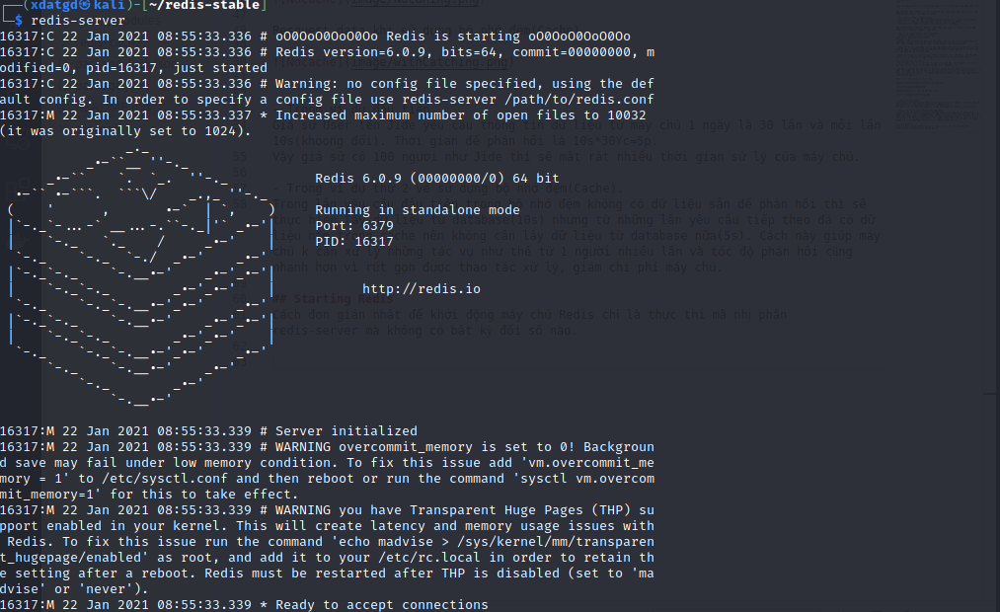
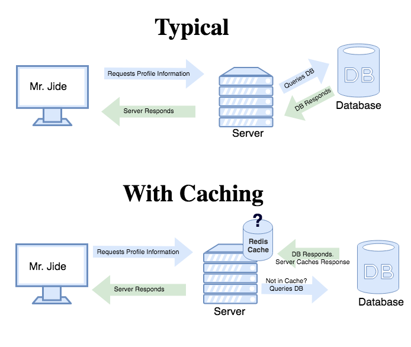

# Redis
***
## Cài đặt redis on Debian(kali-linux)

Cách cài đặt Redis được đề xuất là biên dịch nó từ các nguồn vì Redis không có phụ thuộc nào ngoài một trình biên dịch GCC và libc đang hoạt động. Việc cài đặt nó bằng trình quản lý gói của bản phân phối Linux của bạn hơi không được khuyến khích vì thường phiên bản có sẵn không phải là phiên bản mới nhất.

Bạn có thể tải xuống quả bóng dầu Redis mới nhất từ trang web redis.io hoặc bạn có thể sử dụng URL đặc biệt này luôn trỏ đến phiên bản Redis ổn định mới nhất, đó là http://download.redis.io/redis-stable.tar.gz

Để biên dịch Redis, hãy làm theo các bước đơn giản sau:
```
wget http://download.redis.io/redis-stable.tar.gz
tar xvzf redis-stable.tar.gz
cd redis-stable
make
```
Kiểm tra xem bản dựng của mình đã hoạt động chính xác chưa bằng cách nhập lệnh `make test`

Sau khi biên dịch, thư mục src bên trong bản phân phối Redis được điền với các tệp thực thi khác nhau là một phần của Redis:

`redis-server` chính là Redis Server.
`redis-sentinel` là tệp thực thi Redis Sentinel (giám sát và chuyển đổi dự phòng).
`redis-cli` là tiện ích giao diện dòng lệnh để thao tac với Redis.
`redis-benchmark `được sử dụng để kiểm tra hiệu suất của Redis.

Bạn nên sao chép cả máy chủ Redis và giao diện dòng lệnh vào những nơi thích hợp, bằng cách sử dụng thủ công các lệnh sau:

> sudo cp src/redis-server/ usr/local/bin/
> sudo cp src/redis-cli/ usr/local/bin/
Hoặc chỉ sử dụng sudo make install.

## Starting Redis
Cách đơn giản nhất để khởi động máy chủ Redis chỉ là thực thi mã nhị phân redis-server mà không có bất kỳ đối số nào.



Để khởi động Redis với tệp cấu hình, hãy sử dụng đường dẫn đầy đủ của tệp cấu hình làm đối số đầu tiên:


### Kiểm tra xem Redis có hoạt động không
Redis sử dụng TCP socket và một giao thức cụ thể của Redis

Điều đầu tiên cần làm để kiểm tra xem Redis có hoạt động bình thường hay không là gửi lệnh PING bằng redis-cli:
```
$ redis-cli ping
PONG
```
Nếu câu lệnh trên không hoạt động thì chạy lệnh `sudo apt-get install redis-tools` sau đó chạy lại câu lệnh bên trên.

Để chỉnh sửa PORT của REDIS tại `/etc/redis/redis.conf` có cổng mặc định `6379`
`sudo gedit /etc/redis/redis.conf`

## Cài đặt redis on Window
- Bước 1: Truy cập [Github](https://github.com/microsoftarchive/redis/releases) để dowload Packages phù hợp.

- Bước 2: Cài bản `Redis-x64-3.2.100.msi` hoặc `Redis-x64-3.2.100.zip`

- Bước 3: Start `redis-server.exe` và `redis-cli.exe` để thực hiện thao tác trên `redis`.

## Redis là gì?
- Redis là một mã nguồn mở (được cấp phép BSD), lưu trữ cấu trúc dữ liệu trong bộ nhớ, được sử dụng làm cơ sở dữ liệu, bộ nhớ cache và môi giới tin nhắn.

- Redis lưu trữ dữ liệu bằng cách sử dụng hệ thống key-value do đó rất dễ dàng truy xuất dữ liệu vì không có mối quan hệ phức tạp hoặc các hoạt động khác làm cho cơ sở dữ liệu quan hệ trở nên chậm chạp.

- Redis hỗ trợ một số kiểu dữ liệu (chuỗi, băm, danh sách, tập hợp và tập hợp được sắp xếp) và nó lưu trữ dữ liệu trong bộ nhớ, điều này làm cho nó rất nhanh.

### 1. Bộ nhớ đệm với Redis
- Bộ nhớ đệm là quá trình lưu trữ dữ liệu vào bộ nhớ đệm. Bộ nhớ đệm là nơi lưu trữ dữ liệu tạm thời, nơi dữ liệu được lưu giữ để sử dụng sau này.

- Bộ đệm ẩn như một kho lưu trữ dữ liệu dễ dàng hơn cho máy khách (hoặc máy chủ) tiếp cận, trái ngược với một kho lưu trữ dữ liệu vĩnh viễn có thể nằm trên một dịch vụ khác, cần nhiều thời gian và tài nguyên hơn để tiếp cận (cơ sở dữ liệu hoặc một điểm cuối API bên ngoài ).

### 2. Cách hoạt động của bộ nhớ đệm.

Resquest data khi không sử dụng bộ nhớ đệm(Cache).



Resquest data khi sử dụng bộ nhớ đệm(Cache).
  


- Trong ví dụ đầu tiên.
Giả sử User tên Jide yêu cầu thông tin dữ liệu từ máy chủ 1 ngày là 30 lần và mỗi lần 10s(khoong đổi). Thời gian để phản hồi là 10s*30Yc=5p.
Vậy giả sử có 100 người như Jide thì sẽ mất rất nhiều thời gian sử lý của máy chủ.

- Trong ví dụ thứ 2 về sử dụng bộ nhớ đệm(Cache).
Trong lần yêu cầu đầu tiên trong bộ nhớ đệm không có dữ liệu sẵn để phản hồi thì sẽ thực hiện lấy dữ liệu từ database(10s) nhưng từ những lần yêu cầu tiếp theo đã có dữ liệu nằm trong cache nên không cần lấy dữ liệu từ database nữa(5s). Cách này giúp máy chủ k cần xử lý những tác vụ như thế từ 1 người nhiều lần và tốc độ phản hồi cũng nhanh hơn vì rút gọn được thao tác xử lý, giảm chi phí máy chủ.

## Redis là gì?

### 1. Redis SET

- set thông thường
  ```
    client.set("key", "value", redis.print); // ok
  ```

- set với hashmac
  ```
  // 3 cách này hoạt động giống nhau
    client.hmset(["key", "foo", "bar"], function(err, res) {
        // ...
    });
    
    // Works the same as
    client.hmset("key", ["foo", "bar"], function(err, res) {
        // ...
    });
    
    // Or
    client.hmset("key", "foo", "bar", function(err, res) {
        // ...
    });
  ```

### 2. Redis GET

- get thông thường
  ```
    client.get("key", redis.print); // value
  ```

- hmget với hashmac
  ```
    // get 1 trường  key
    client.hmget("secret","key", function(err, res) {
        // ...
    });
    // get 1 trường  key
    client.hmget("secret","key1","key2", function(err, res) {
        // ...
    });
    client.hgetall("secret", function(err, value) {
        console.log(value.foo); // > "bar"
        console.log(value.hello); // > "world"
    })
  ```
- get all toàn bộ data
```
    redis-cli keys "*"
```

### 3. Redis update

- update 1 data

  ```
  // Update cho thường
    client.set("key", "value", redis.print); // ok

    // Update cho trường set có sử dụng hashmac
    client.hmset("secret","key", "value", redis.print); // ok
  ```

- update muti key

```
    client.set(["key1","value1"],["key2","value2"] redis.print);
    client.hmset(["secret"],["key1","value1"], redis.print);
```

### 4. Redis DEL

- Delete 1 key

```
client.del("key", redis.print);
```

- Delete muti key

```
client.del("key1","key2",["key3...n"], redis.print);
```

Note : 
- FLUSHDB - Xóa tất cả các khóa khỏi cơ sở dữ liệu hiện tại của kết nối: `redis-cli flushdb`

- FLUSHALL - Xóa tất cả các khóa khỏi tất cả các cơ sở dữ liệu. `redis-cli flushall`